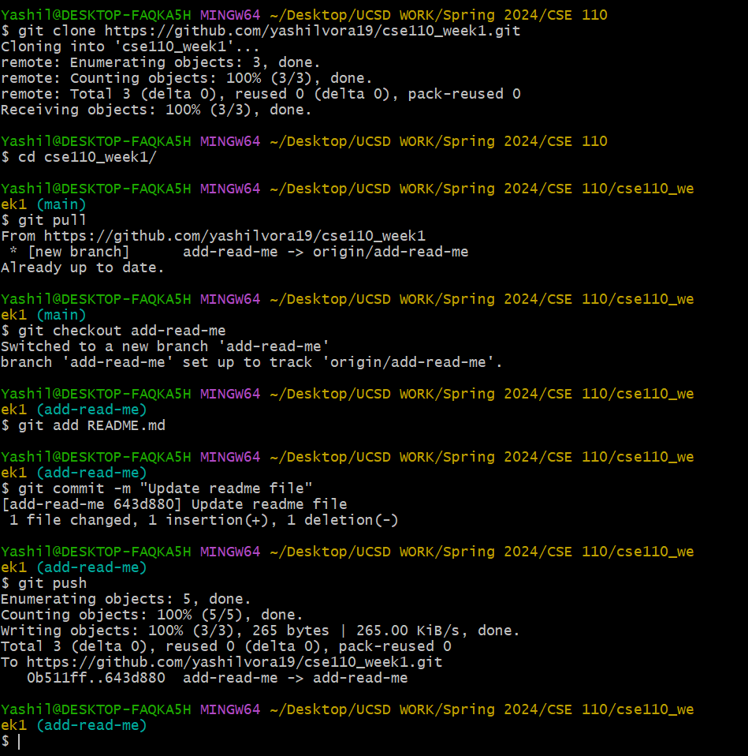

# User Page

### About Me!

Hey there! My name is Yashil Vora and I am a second-year Computer Science major from Seventh College. Living in San Diego over the past year and a half has been a great experience for me and I have come to really love this city and university.

#### My Hobbies

1.  Basketball
2.  Squash
3.  Piano
4.  Watching movies

Here are some of the things I want to do in San Diego (the ones ticked are places I've already been to)!

- [ ] Balboa Park
- [x] Seaport Village (completed)
- [ ] Gaslamp
- [x] Sunset Cliffs

#### My CS Background

I started coding in highschool. Here are some of the technologies that I am familiar with:

- **Languages:** Python, JavaScript, Java, C, C++
- **Frameworks:** React, Node.js, Express.js, Vue.js,  Pytorch, Tensorflow, Scikit-learn
- **Databases:** PostgreSQL, MongoDB
- **Tools:** Git, Docker, VS Code, Junit

The very first line of code that I wrote was:

`print("Hello, World!")`

Another one of my first code samples is: 

```python
def greet(name):
    print(f"Hello, {name}!")
```
 
I am also familiar with using Linux commands and Git commands. Here is a screenshots of this!



> Here's a quote really inspires me:
>
> "Success is not final.
> 
>  Failure is not fatal.
> 
>  It is the courage to continue that counts." - Winston S. Churchill


Here is the [link](README.md) to the _README_ file for this repository!

*To learn more about my projects, check out my [github](https://github.com/yashilvora19)*

To check out my CS Background, click [here](#my-cs-background).


To go back to the top of this page, click [here](#about-me)


External Links
Section links
Relative links (Link to another .md file or an image in your repo. If linking to an image, encode it as a regular link rather than an image.)
Ordered and Unordered Lists
Task lists


Once you are finished, publish your web page through Github Pages - instructions hereLinks to an external site.. Include the URL to the published site in your README.md file.

